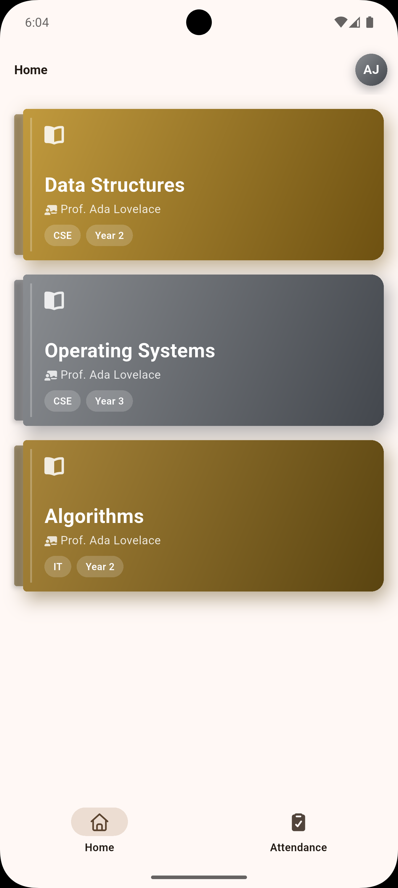
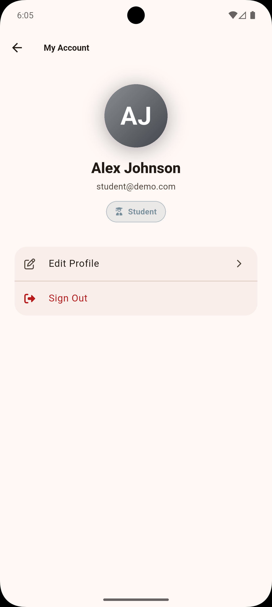
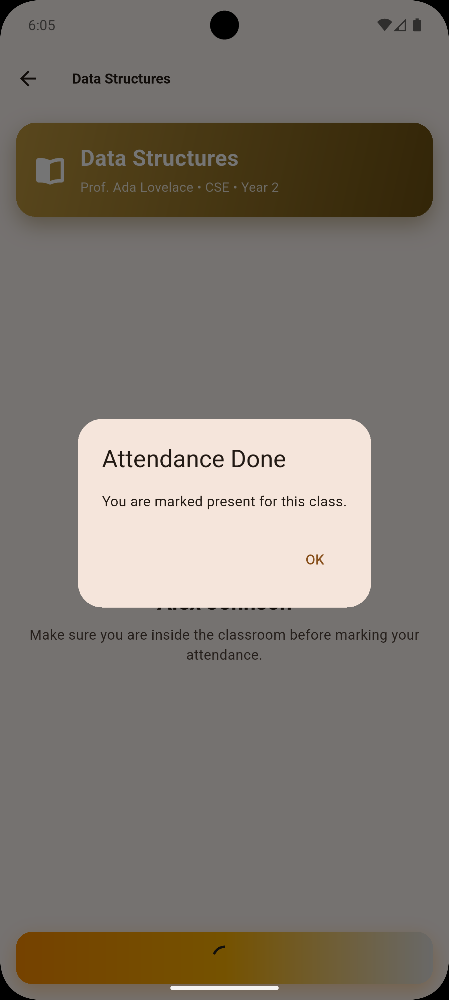
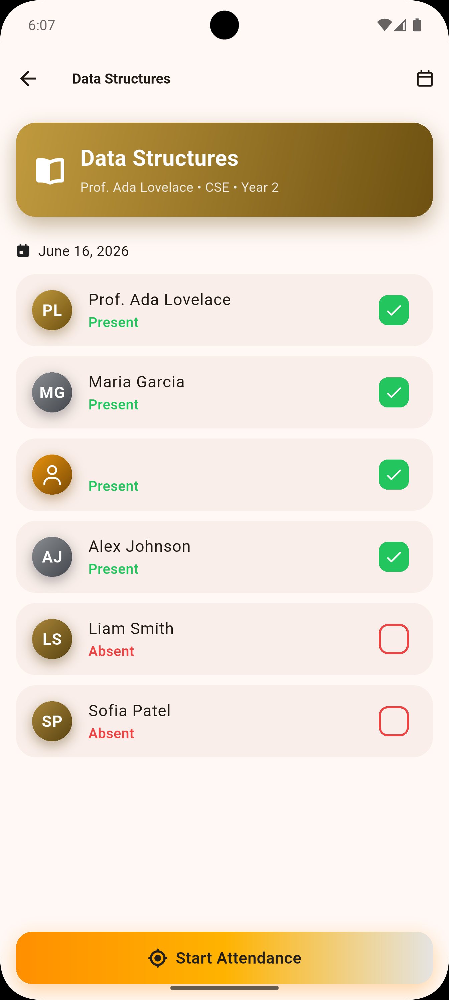

# Geo Attendance App

## 📌 Description

Geo Attendance App is a location-based attendance tracking system that ensures students are physically present in class before they can mark themselves as present. It utilizes **Geolocator** to determine the student's real-time position and verifies if they are within the allowed range of the classroom location.

## Table of Contents

1. [Features](#features)

2. [Screenshots](#screenshots)

3. [Installation](#installation)

4. [Firebase Setup](#firebase-setup)
    - [Android](#android)
    - [iOS](#ios)

5. [Customization](#customization)
    - [App Name](#app-name)
    - [App Package Name](#app-package-name)
    - [App Icon](#app-icon)

6. [Build](#build)

7. [Authors](#authors)

## Features

- [x] Uses **Geolocation** to track student location.
- [x] Compares student location with classroom location.
- [x] Marks students **present** if they are within **100 meters** of the class.
- [x] Marks students **absent** if they are outside the allowed range.
- [x] Stores attendance data in **Firestore**.
- [x] Displays confirmation dialogs for attendance status.

## Screenshots

| Login Screen | Home  |  Attendance | Profile  |  Done | Teacher  |
| ------------ | ----------- | ----------------- | -------------- | --------------- | --------------- |
|  |  |  |  |  |  |

## Installation

1. Clone the repository:

```sh
git clone https://github.com/mantreshkhurana/geo-attendance-app.git
cd geo-attendance-app
flutter pub get
```

## Firebase Setup

To connect your own Firebase project:

```sh
npm install -g  flutterfire_cli
flutterfire configure
```

This regenerates `lib/firebase_options.dart` and the platform config files with real credentials.

### Android

The app requires Firebase. It ships with placeholder config (`lib/firebase_options.dart` and `android/app/google-services.json`) so it builds and runs, but auth, Firestore, and storage will not work until you connect a real project.

### iOS

The app requires Firebase. It ships with placeholder config (`lib/firebase_options.dart` and `ios/Runner/GoogleService-Info.plist`) so it builds and runs, but auth, Firestore, and storage will not work until you connect a real project.
Also open ios folder in Xcode and add the GoogleService-Info.plist file to the Runner target.
Then add Firebase ios sdk to the project.

## Customization

### App Name

First activate the rename package:

```sh
dart pub global activate rename
```

### App Package Name

To change the app name run:

```sh
rename setAppName --targets ios,android --value "YourAppName"
```

To change app package name run:

```sh
rename setBundleId --targets android --value "com.example.bundleId"
```

### App Icon

To change the app icon, replace the `assets/images/logo.png` file with your desired icon and run:

```sh
flutter pub get
dart run icons_launcher:create
```

## Build

To build the app, run:

```sh
flutter pub get
flutter build apk
```

## Authors

- [Mantresh Khurana](https://github.com/mantreshkhurana)
