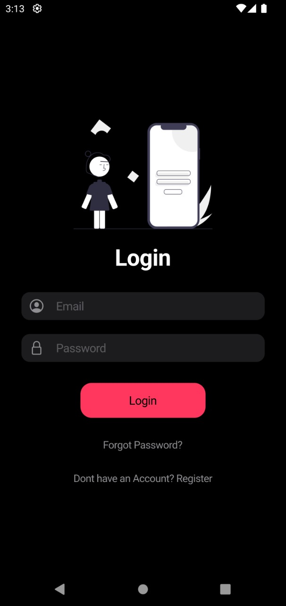
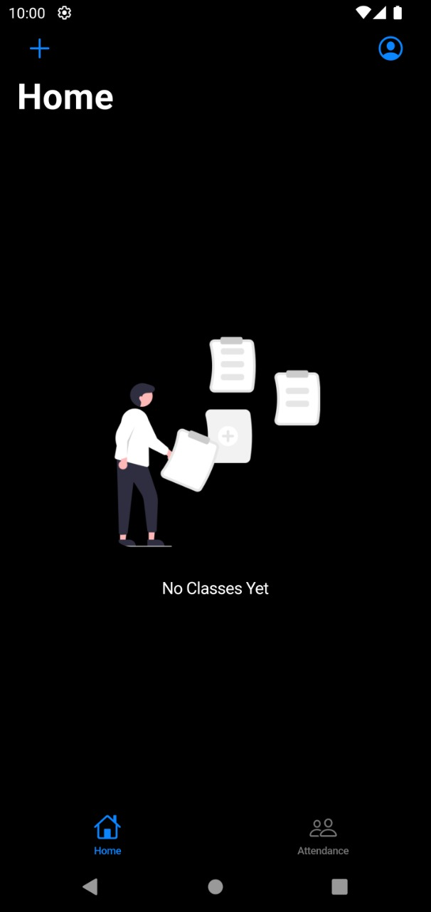
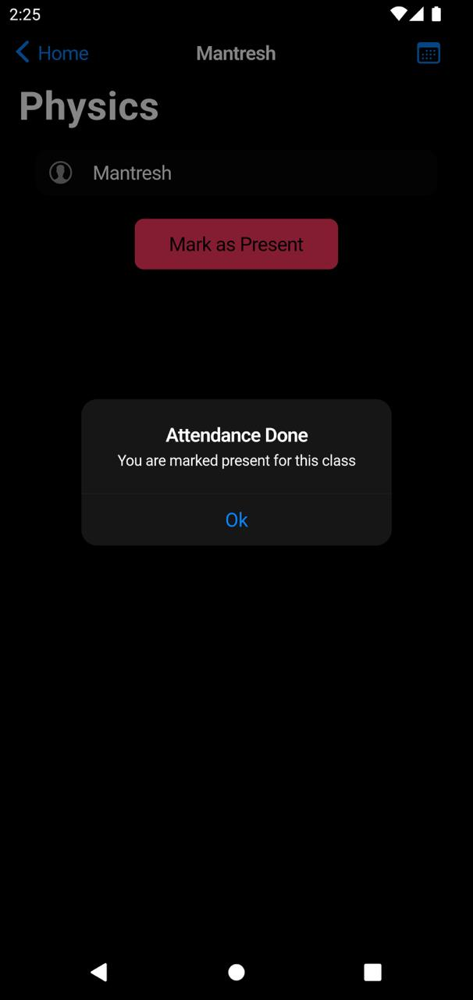
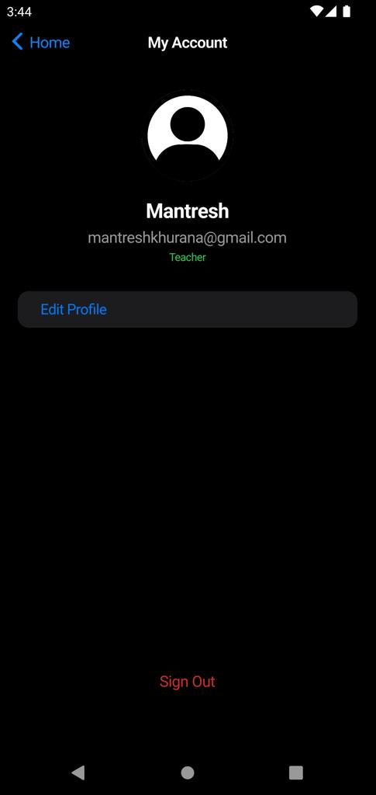
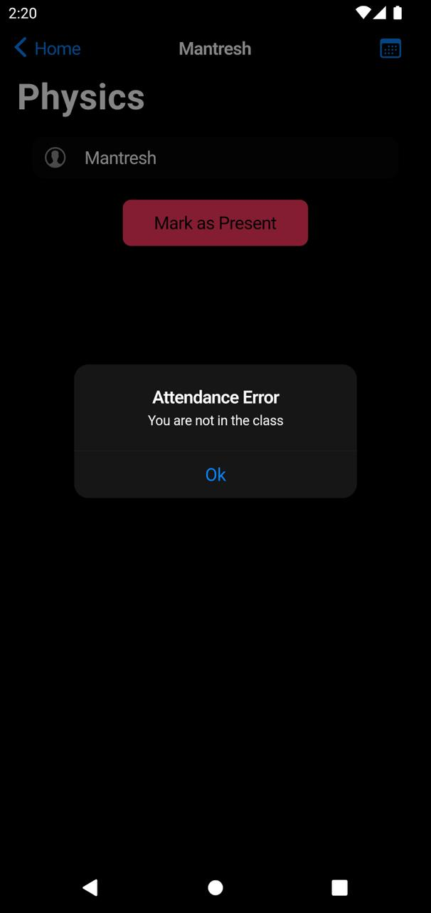

# Geo Attendance App

## 📌 Description

Geo Attendance App is a location-based attendance tracking system that ensures students are physically present in class before they can mark themselves as present. It utilizes **Geolocator** to determine the student's real-time position and verifies if they are within the allowed range of the classroom location.

## 📖 Table of Contents

1. [Features](#-features)
2. [Screenshots](#-screenshots)
3. [Installation](#-installation)
4. [Build](#-build)
5. [Authors](#-authors)


## ✅ Features

- [x] Uses **Geolocation** to track student location.
- [x] Compares student location with classroom location.
- [x] Marks students **present** if they are within **100 meters** of the class.
- [x] Marks students **absent** if they are outside the allowed range.
- [x] Stores attendance data in **Firestore**.
- [x] Displays confirmation dialogs for attendance status.

## 📸 Screenshots

| Login Screen | Home  |  Attendance | Profile  |  Done | Error |
| ------------ | ----------- | ----------------- | -------------- | --------------- | ----- |
|  |  |  |  |  |  |

## 🛠️ Installation

1. Clone the repository:

   ```sh
   git clone https://github.com/mantreshkhurana/geo-attendance-app.git
    cd geo-attendance-app
    flutter pub get
    ```

## Author

- [Mantresh Khurana](https://github.com/mantreshkhurana)
